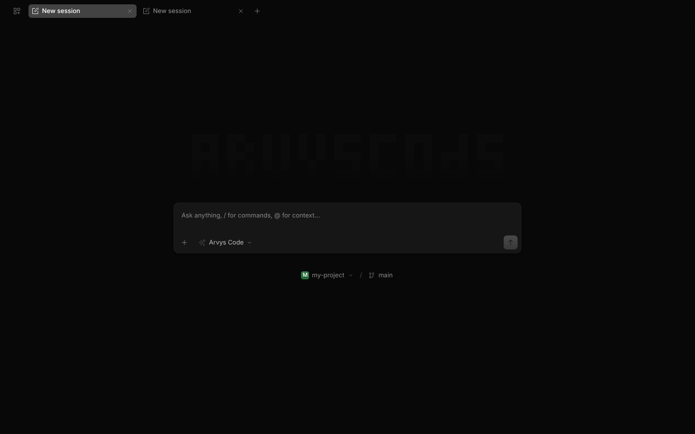
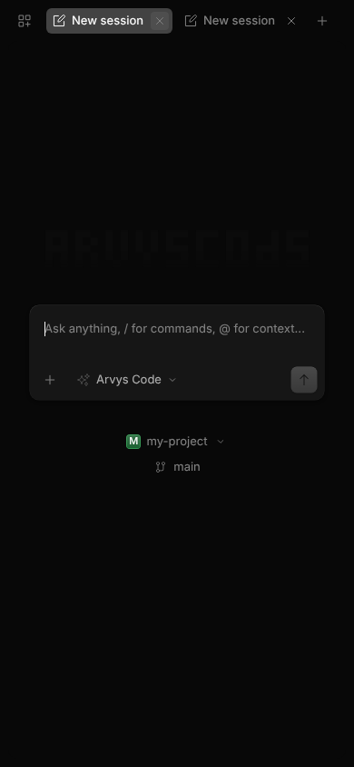

# ARVYS CODE

Agent de codage IA, terminal-native, propulsé par deux modèles internes.

## Aperçu





## Présentation

ARVYS Code est un agent de développement qui vit dans le terminal : il lit votre code, l'écrit, le corrige et l'exécute sous vos ordres. Le moteur open-source opencode a été intégralement rebrandé et étendu avec deux modèles d'IA internes et un produit web complet — téléchargement APK Android, PWA iPhone réelle et application navigateur.

Le moteur est **opencode v2 (2.0.22)**, installé via le paquet npm officiel `@opencode/cli` — nouvelle interface web native (responsive mobile, terminal PTY intégré, temps réel SSE). Le rebranding est appliqué **à la volée par le cœur** (`proxy-core.js`) : textes, titres, manifest et marques remplacés dans chaque réponse. Le binaire agent reste officiel et jamais modifié, pour la stabilité.

## Fonctionnalités

- **Deux IA internes**
  - `arvys-code` — le raisonneur : architecture, refactoring, débogage complexe
  - `arvys-flash` — le rapide : complétions, questions courtes, itérations instantanées
  - Bascule automatique et transparente entre modèles ; API compatible OpenAI (`/v1/chat/completions`, streaming SSE)
- **Terminal intégré** — exécution de commandes côté serveur via un pont PTY
- **APK Android réel** — binaire complet packagé, prêt à installer (`/download`)
- **PWA iPhone réelle** — manifest standalone + service worker : « Ajouter à l'écran d'accueil » installe la vraie application
- **Application navigateur** — la même UI complète sur desktop
- **Rebranding intégral** — logos, wordmark, écrans de démarrage ARVYS appliqués jusqu'au bundle UI

## Architecture

```
ARVYS Code (:3000)   cœur public — UI, API, ponts SSE / PTY / vocal
├── Agent (:3001)    binaire agent officiel, jamais modifié
└── Passerelle IA (:3002)   endpoint compatible OpenAI des 2 modèles internes
```

| Chemin | Rôle |
|---|---|
| `proxy-core.js` | Le cœur : sert l'UI, proxifie l'agent, expose les ponts |
| `gateway/arvys_zai_gateway.js` | Passerelle des 2 modèles : chaînes de bascule, streaming, timeouts |
| `arvys-cloud/` | La vitrine : `/download`, `/chat`, manifest PWA, service worker, APK (l'interface v2 est servie en direct par le cœur) |
| `.zscripts/dev.sh` | Superviseur de démarrage (relance automatique du cœur) |

## Démarrage

```bash
# 1) Dépendances — installe aussi le binaire agent v2 via @opencode/cli
npm install        # ou bun install

# 2) Binaire agent (~200 Mo, non versionné dans git)
mkdir -p oc-bin
cp node_modules/@opencode/cli-linux-x64/bin/opencode oc-bin/opencode-custom
chmod +x oc-bin/opencode-custom

# 3) Lancer — la config des 2 modèles internes (config/opencode.jsonc) est
#    injectée automatiquement par le cœur, l'authentification de l'agent v2
#    est portée par le proxy : rien d'autre à faire.
node proxy-core.js
# → http://localhost:3000
```

Le cœur spawn et supervise lui-même l'agent (:3001) et la passerelle IA (:3002). La passerelle lit sa configuration dans `gateway/cf-ai.json` (non versionné) :

```json
{ "account_id": "...", "api_token": "..." }
```

ou par les variables d'environnement équivalentes. Sans configuration, les endpoints IA répondent 503 proprement.

## Pages web

| Page | Rôle |
|---|---|
| `/` | L'application complète (réservée aux mobiles Android & iPhone) |
| `/download` | Guide d'installation, pont QR code PC → Mobile & téléchargement APK |
| `/desktop-block.html` | Page d'accueil desktop invitant à utiliser OpenCode et à scanner le QR code |
| `/offline.html` | Page de secours hors-ligne avec reprise automatique |
| `/sw.js` | Service Worker v3 avec precache coquille et offline |
| `/__status` | Diagnostics du serveur, de l'agent, de la passerelle et de l'IP LAN |

## Installer sur Android / iPhone depuis votre réseau

Arvys Code est une application **100 % conçue pour mobile** (smartphone Android et iPhone). Le PC sert de serveur hôte local. Pour installer la PWA réelle et bénéficier du mode plein écran et hors-ligne, les navigateurs modernes exigent un **contexte sécurisé** (HTTPS ou localhost).

Voici les 4 options recommandées, de la plus simple à la plus avancée :

### 1. Android par câble USB (`adb reverse`) — Zéro config
Idéal pour développer ou tester sans aucun certificat ni configuration réseau :
```bash
# Branchez le téléphone en débogage USB
adb reverse tcp:3000 tcp:3000
```
Ouvrez ensuite `http://localhost:3000` sur Chrome mobile. Le navigateur traite `localhost` comme un contexte sécurisé : le Service Worker s'active et l'installation PWA native est immédiatement disponible.

### 2. Tailscale (Recommandé sans fil) — Installation partout
La solution la plus fluide pour iPhone et Android :
```bash
# Activer le HTTPS automatique avec votre domaine Tailscale
tailscale serve https / http://127.0.0.1:3000
```
Vous obtenez une adresse officielle `https://mon-pc.mon-domaine.ts.net` avec certificat TLS valide reconnu par iOS et Android. L'installation PWA fonctionne sur votre réseau local et même à distance en mobilité.

### 3. Tunnel Cloudflare (`cloudflared`) — Accès instantané
Générez une URL HTTPS publique sécurisée en une seule commande :
```bash
cloudflared tunnel --url http://127.0.0.1:3000
```
Scannez l'adresse HTTPS affichée sur votre téléphone pour installer la PWA.

### 4. mkcert ou TLS natif du cœur (`ARVYS_TLS_CERT` / `ARVYS_TLS_KEY`)
Générez vos propres certificats locaux avec `mkcert` et lancez le cœur directement en HTTPS :
```bash
ARVYS_TLS_CERT=./cert.pem ARVYS_TLS_KEY=./key.pem node proxy-core.js
```

## Mode Hors-Ligne & Supervision Réseau

- **Mode local :** Lorsque le téléphone perd l'accès à Internet, la coquille et le terminal restent opérationnels sur votre réseau WiFi local.
- **Bannière d'état :** Une pastille discrète indique si l'app est connectée ou hors ligne.
- **Reprise automatique :** Dès le retour de la connexion Internet, les modèles `arvys-code` et `arvys-flash` se reconnectent sans nécessiter de rafraîchissement manuel.
- **Cache sessions :** L'historique des requêtes et configurations est mis en cache dans IndexedDB pour la consultation hors réseau.

## Déploiement sur Render & Configuration Groq (20 messages / jour, réinitialisation à 00h)

Pour déployer ArvysCode sur [Render](https://render.com) et configurer vos modèles avec votre clé API Groq :

1. **Créer un Web Service sur Render** :
   - Connectez votre dépôt GitHub `Aeronscript/Arvyscode`.
   - **Build Command** : `npm install`
   - **Start Command** : `npm start` (ou `node proxy-core.js`)
   - **Environment** : Node.js

2. **Configurer les Variables d'Environnement sur Render** :
   Dans l'onglet **Environment** de votre service Render, ajoutez :
   - `GROQ_API_KEY` = `votre_clé_api_groq` (ex: `gsk_...`)
   - `PORT` = `3000` (ou laissez Render attribuer son port par défaut, le proxy s'adapte automatiquement).

3. **Modèles et Quota (20 messages / 00h)** :
   - **`arvys-code`** utilise `llama-3.3-70b-versatile` (raisonnement, architecture, refactoring).
   - **`arvys-flash`** utilise `llama-3.1-8b-instant` (itérations rapides, questions courtes).
   - **Quota intégré** : Le système applique par défaut une limite de **20 requêtes/messages par jour**, avec une **réinitialisation automatique à 00:00 UTC** (minuit). Si la limite est atteinte, une notification claire s'affiche. En renseignant votre `GROQ_API_KEY` personnelle, l'usage devient illimité ou géré selon votre quota Groq.

## Workspace verrouillé, sélecteur propre & Persistance (Render gratuit)

### Workspace dédié + verrou serveur (sécurité)

L'agent démarre désormais dans un **workspace dédié** (`<projet>/workspace`, remplaçable via `ARVYS_WORKSPACE`). Le sélecteur de projets part de ce dossier vide — plus aucun projet « Arvys Code » pré-rempli. Et le cœur **refuse tout chemin hors du workspace**, présent dans la query ou le corps JSON des requêtes (`path`, `dir`, `cwd`, `folder`, `worktree`…) : plus jamais d'accès aux `.env`, aux clés ou aux sources de l'application depuis l'interface. En cas de souci, `ARVYS_LOCK=0` désactive le verrou (dépannage uniquement) — chaque refus est journalisé dans `/__status`.

Si le workspace empêchait jamais l'agent de démarrer, le cœur bascule automatiquement sur l'ancien comportement (repli `ROOT`) après 4 tentatives — impossible de retomber sur une page d'attente infinie.

### Persistance sans payer : instantanés Git automatiques

Sur Render **gratuit**, le disque est éphémère : chaque mise en veille ou redéploiement efface tout — d'où la perte des discussions. Arvys Code embarque désormais une persistance intégrée (`persistence.js`) :

- **Au démarrage**, le dernier instantané est restauré **avant** le lancement de l'agent (sessions, messages, auth, projets).
- **Toutes les 3 minutes** et **à l'arrêt** (SIGTERM), un instantané est poussé vers un dépôt GitHub **privé** : historique = 1 commit amendé + force-push, la taille du dépôt reste stable.
- **Couvert** : `~/.local/share/opencode` (sessions & messages), `~/.config/opencode` (auth/config), le **workspace** (projets importés/créés) + dossiers additionnels via `ARVYS_SNAP_DIRS="cle:/chemin"`. `node_modules`, `.git` imbriqués et fichiers > 25 Mo sont exclus automatiquement.
- **Perte maximale en cas d'incident : ~3 minutes.**
- **Sans configuration, le module est inerte** (aucun effet de bord).

Configuration (≈ 3 minutes) :

1. Créez un dépôt GitHub **privé** vide, ex. `Aeronscript/arvys-data`.
2. Créez un **fine-grained token** (Settings → Developer settings → Fine-grained tokens) avec **Contents : Read and Write**, limité à ce dépôt uniquement.
3. Sur Render (onglet Environment), ajoutez :
   - `ARVYS_SNAP_REPO` = `Aeronscript/arvys-data`
   - `ARVYS_SNAP_TOKEN` = `github_pat_…`
   - Optionnels : `ARVYS_SNAP_INTERVAL_S` (défaut `180`), `ARVYS_WORKSPACE` (chemin du workspace), `ARVYS_SNAP_DIRS` (dossiers additionnels).

> ⚠️ N'utilisez pas le même token pour ce dépôt et pour pousser du code. Le token de snapshots ne sert qu'à lire/écrire dans `arvys-data`, jamais dans le dépôt applicatif.

### Keep-alive (anti cold-start)

`.github/workflows/keep-alive.yml` (fichier fourni à la racine du projet / livré séparément — GitHub exige le scope `workflow` sur le token pour pousser ce fichier ; ajoutez-le via l'interface GitHub → *Add file* si besoin) interroge `/__status` toutes les 10 minutes pour éviter l'endormissement de l'instance gratuite (le fameux 502 au premier accès). À savoir : GitHub désactive les workflows planifiés après **60 jours sans activité** sur le dépôt — un simple push ou une relance manuelle dans l'onglet **Actions** réactive le workflow. Vous pouvez aussi le désactiver : les instantanés couvrent chaque réveil de toute façon.

## Crédits

Basé sur le projet open-source [opencode](https://github.com/sst/opencode) (MIT), rebrandé et étendu par ARVYS.


